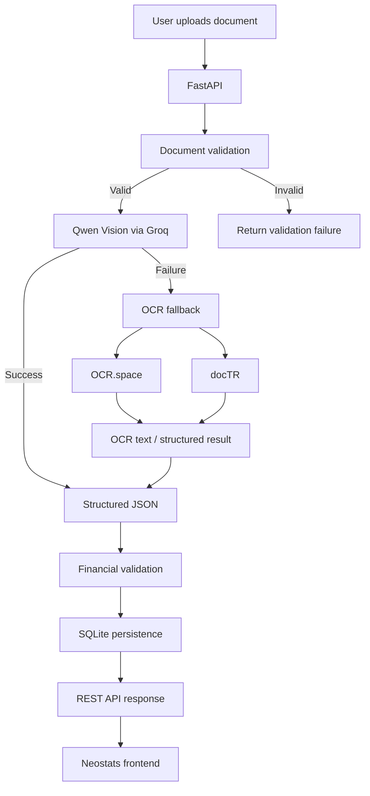

# Neostats — Financial Document Intelligence

Neostats is a small end-to-end document intelligence system built to turn financial documents into structured, checkable data.

The idea is simple:

> Give the system an invoice or financial statement. It reads the document, extracts the information that matters, checks the numbers where possible, stores the result, and presents everything in a way that is easy to inspect.

The project was built as an AI Engineer internship case study, with particular attention to the part that is often missed in document extraction systems: **extraction alone is not enough. The extracted numbers should also be checked.**

---

## What Neostats can handle

The system currently supports four document types:

- Invoice
- Balance Sheet
- Profit & Loss
- Cash Flow Statement

Documents can be supplied as:

- PDF
- JPG
- JPEG
- PNG

PDF documents are limited to three pages.

The user selects the document type before processing. Automatic document classification is intentionally not part of this version.

---

## What happens after a document is uploaded?

The processing flow is roughly:

**Upload → Validate → Extract → Validate the numbers → Store → Display**

More specifically:

1. The uploaded file is checked for supported format, readability, and page count.
2. The primary extraction path sends the document to a vision-capable Qwen model through Groq.
3. For documents where the primary extraction cannot be completed, an OCR fallback is available.
4. OCR text can be processed through OCR.space and docTR.
5. The extracted information is converted into structured JSON.
6. Financial consistency checks are run against the extracted values.
7. The complete result is stored in SQLite.
8. The frontend displays the extracted fields, line items, validation results, processing information, and raw JSON.

The important design choice here is that **a successful extraction and a successful financial validation are treated as separate things**. A document can be readable and successfully extracted while still failing a financial consistency check.

---

## A look at the architecture



The application is intentionally split into services rather than putting everything into a single route. This keeps document validation, extraction, OCR fallback, financial validation, and API handling separate enough to test and maintain.

---

## The AI extraction layer

The primary extraction model is:

**Qwen (`qwen/qwen3.8-27b`) through Groq**

The model receives the document as an image (PDF pages are rendered to images first) and is asked to return structured JSON.

The extraction prompt tells the model to:

- extract meaningful visible information
- preserve actual field and line-item names
- preserve comparative periods
- return `null` when information is missing
- avoid inventing values
- return monetary values as numbers
- treat bracketed/parenthesized values as negative
- extract invoice line items including description, quantity, unit price, and amount

The current completion limit is deliberately kept at **900 tokens** because the Groq service tier used during development enforces a lower output-token limit. The extraction prompt is therefore kept compact as well.

This was an important practical constraint: a theoretically larger response limit does not help if the API service tier rejects the request before the model processes the document.

---

## OCR fallback

The primary path is not the only path.

If the Qwen extraction request fails, Neostats can fall back to OCR processing.

The fallback currently uses:

- **OCR.space**
- **docTR**

The OCR parser contains some document-specific handling because real OCR output is not always nicely structured. In particular, invoice tables may arrive as fragmented cells rather than complete rows.

The fallback parser therefore:

- reconstructs invoice rows using item-number markers such as `1.`, `2.`, `3.`
- handles fragmented OCR table output
- handles both decimal formats such as `126.27` and `126,27`
- searches summary information carefully to reduce collisions between table headers and unrelated numbers
- avoids treating identifiers such as tax IDs and IBANs as financial totals where possible

The fallback exists because real-world document processing is messy. A production system should expect imperfect OCR rather than assuming every document arrives as clean machine-readable text.

---

## Financial validation

This is one of the main parts of the project.

After extraction, Neostats performs calculations against the extracted values.

### Invoices

Where the necessary values are available, the system checks:

**Quantity × Unit Price = Line Item Amount**

It also checks:

**Sum of Line Item Amounts = Subtotal**

And:

**Subtotal + Tax + Shipping/Handling − Discount = Total**

For example, the invoice used during testing produced:

- Subtotal: `126.27`
- Tax: `12.63`
- Total: `138.90`

The seven extracted line items also reconciled to the subtotal.

Result:

**Financial validation: PASS**

### Balance Sheets

The system checks whether:

**Total Capital and Liabilities = Total Assets**

Comparative-period values are checked when the required fields are available.

### Profit & Loss

The system can check:

**Interest Earned + Other Income = Total Income**

and:

**Total Income − Total Expenditure = Profit Before Minority Interest**

### Cash Flow Statements

The system checks the available cash-flow relationships, including:

**Opening Cash + Net Change in Cash = Closing Cash**

and, where the required components are available:

**Operating Cash Flow + Investing Cash Flow + Financing Cash Flow + FX Adjustment = Net Change in Cash**

An explicit adjustment such as cash on amalgamation is also considered when it is present in the extracted data.

---

## Missing values are not silently invented

One of the requirements of this project is that the system should not manufacture information just because a schema contains a field.

If a value cannot be reliably extracted, the expected representation is:

```json
null
```

Similarly, a financial check is marked `NOT_APPLICABLE` when the information required to perform that particular check is not available.

That distinction matters.

`NOT_APPLICABLE` means:

> There was not enough applicable information to perform this check.

It does **not** mean:

> The financial numbers were proven correct.

---

## API

The backend is built with FastAPI.

The main endpoints are:

| Method | Endpoint | Purpose |
|---|---|---|
| `POST` | `/api/v1/documents/process` | Upload and process a document |
| `GET` | `/api/v1/documents/{document_name}` | Retrieve the latest result for a document |
| `GET` | `/api/v1/documents` | List processed documents |
| `GET` | `/api/v1/health` | Health check |

FastAPI's interactive Swagger documentation is available at:

`/docs`

The processing endpoint accepts a multipart file together with the selected `document_type`.

---

## Response structure

A processed document is returned in a predictable structure:

```json
{
  "document_name": "batch1-1109.jpg",
  "document_type": "Invoice",
  "processing_status": "PASS",
  "file_validation": {},
  "extracted_data": {},
  "validation": {},
  "processing_metadata": {}
}
```

The response deliberately keeps extraction and validation separate.

A validation check contains information such as:

```json
{
  "name": "invoice_total_check",
  "formula": "subtotal + tax + shipping_and_handling - discount",
  "operands": {
    "subtotal": 126.27,
    "tax": 12.63,
    "shipping_and_handling": 0.0,
    "discount": 0.0
  },
  "calculated_value": 138.9,
  "reported_value": 138.9,
  "variance": 0.0,
  "status": "PASS"
}
```

This makes the result explainable instead of reducing everything to a single confidence number.

---

## Frontend

The frontend is deliberately lightweight.

It provides:

- document-type selection
- file upload
- processing
- document history
- extracted fields
- invoice line items
- financial validation results
- processing metadata
- raw structured JSON

The interface was designed as an editorial/minimal financial product rather than a generic admin dashboard. The goal is to keep the extracted information readable while making failures and validation results visible.

---

## Persistence

Processed documents are stored using:

**SQLite + SQLAlchemy**

The database stores the uploaded document information, processing status, extracted result, and timestamp.

This means results remain available after the individual request has finished instead of existing only in browser memory.

---

## Project structure

```text
Project N/
│
├── backend/
│   ├── app/
│   │   ├── api/
│   │   │   └── routes/
│   │   ├── core/
│   │   ├── models/
│   │   ├── repositories/
│   │   ├── schemas/
│   │   ├── services/
│   │   │   ├── document_extraction_service.py
│   │   │   ├── document_processing_service.py
│   │   │   ├── document_validation_service.py
│   │   │   ├── financial_validation_service.py
│   │   │   ├── ocr_fallback_service.py
│   │   │   ├── ocr_space_service.py
│   │   │   └── doctr_ocr_service.py
│   │   └── main.py
│   │
│   ├── tests/
│   └── uploads/
│
├── frontend/
│   ├── templates/
│   │   └── index.html
│   └── static/
│       ├── css/
│       ├── js/
│       └── images/
│
├── docs/
├── sample_outputs/
├── .env
└── README.md
```

---

## Running the project locally

Create and activate the virtual environment, then install the required packages.

The backend can be started from the `backend` directory with:

```powershell
uvicorn app.main:app --reload
```

Once the server starts:

- Frontend: `http://127.0.0.1:8000/`
- Swagger: `http://127.0.0.1:8000/docs`

API keys and other configuration values belong in the root `.env` file.

**Do not commit `.env` to GitHub.**

---

## Configuration

The application reads configuration from environment variables.

The main settings include:

- `GROQ_API_KEY`
- `OCR_SPACE_API_KEY`
- model configuration
- database configuration
- file-size configuration

The repository should contain a safe example configuration if one is provided, but real credentials must remain outside version control.

---

## Testing

The project includes automated tests covering the main required areas.

The test suite checks:

- valid and invalid document files
- corrupt/unreadable files
- invoice financial calculations
- failed financial calculations
- the FastAPI health endpoint

Run the tests from the `backend` directory:

```powershell
pytest -q
```

Current test result during development:

**6 tests passed**

There is also a deprecation warning from a dependency used by the Starlette test client. It does not cause the test suite to fail.

---

## Example: successful invoice extraction

One of the invoices used during testing was extracted with the primary Qwen path rather than the OCR fallback.

The result included:

- invoice number: `94404257`
- vendor: `Cruz PLC`
- customer: `Sandoval-Phillips`
- subtotal: `126.27`
- tax: `12.63`
- total: `138.90`
- 7 line items

All applicable invoice validation checks passed.

This was useful as an end-to-end test because it exercised the full path from document image through vision extraction and then through deterministic financial validation.

---

## AI usage declaration

AI was used as a core part of this project.

The primary AI component is the Qwen vision model accessed through Groq. It is responsible for interpreting document images and extracting structured financial information.

AI assistance was also used during development for:

- implementation guidance
- debugging
- code review
- prompt refinement
- identifying edge cases
- improving the OCR fallback logic

The financial validation calculations themselves are deterministic application logic. They are not delegated to the language model.

This separation is intentional: the model interprets the document, while the application performs the arithmetic checks.

---

## Limitations

This is an internship case-study implementation rather than a production-grade financial document platform.

Some important limitations remain:

- OCR quality depends heavily on document quality and layout.
- Vision models can still make extraction mistakes.
- Highly fragmented or unusual tables may require additional document-specific parsing.
- The current financial validation rules cover the specified relationships rather than every accounting rule.
- Automatic document classification is not implemented.
- Confidence/evidence handling is not yet as comprehensive as a production document intelligence platform would require.
- SQLite is appropriate for this demonstration but would normally be replaced by a production database for concurrent workloads.
- External AI/OCR services introduce dependency on network availability, quotas, latency, and provider limits.
- Production deployment would require stronger authentication, rate limiting, secret management, monitoring, and more comprehensive security controls.

The system therefore treats extraction and validation as two separate layers rather than assuming that an extracted value is automatically trustworthy.

---

## Production considerations

If this were taken beyond the case study, the next improvements would be fairly straightforward:

**Reliability**

Add stronger confidence scoring, page-level evidence, schema validation, retry policies, and more robust handling of malformed model output.

**Security**

Add authentication, authorization, file-content inspection, stricter upload controls, rate limiting, secure secret management, and isolation for document processing.

**Scalability**

Move from SQLite to PostgreSQL, store documents in object storage, and process larger documents asynchronously using a job queue.

**Observability**

Add structured logging, request tracing, model latency/token metrics, OCR fallback metrics, and alerts for repeated extraction failures.

**Evaluation**

Build a labelled benchmark containing invoices and financial statements with known ground-truth fields, then measure field-level extraction accuracy and validation accuracy rather than relying only on manual inspection.

---

## Why the project is structured this way

The main lesson behind Neostats is that a document intelligence system should not end at:

**"The AI extracted some JSON."**

For financial documents, the more useful pipeline is:

**"The AI extracted structured information, the application checked what could be checked, and the user can see exactly what happened."**

That is the distinction this project is designed to demonstrate.

---

## Status

The core application is implemented and tested across the four requested document types:

- Invoice — tested
- Balance Sheet — tested
- Profit & Loss — tested
- Cash Flow Statement — tested

The project also includes image/PDF handling, OCR fallback, financial validation, persistent storage, REST APIs, a web interface, and automated tests.

The remaining work for a final submission is primarily documentation, packaging, GitHub publication, deployment, and final end-to-end verification.
